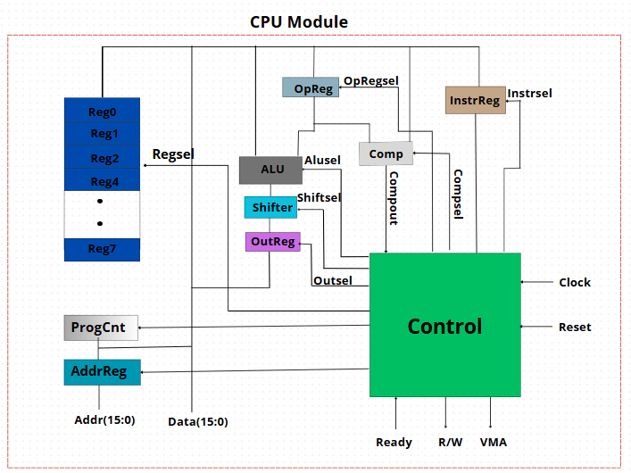
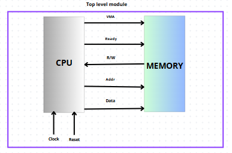

# 16-Bit CPU Design

## Overview

This project presents the design of a compact **16-bit microprocessor**. The processor is built using fundamental components that work together to execute instructions efficiently. 

### Key Features:
- **8 General-Purpose 16-bit Registers** for storing data
- **Arithmetic Logic Unit (ALU)** for performing computations
- **Shifter** for bitwise operations
- **Program Counter (PC)** to track execution flow
- **Instruction Register** to hold the current instruction
- **Comparator** for conditional operations
- **Address Register** for memory access
- **Control Unit** to manage execution flow
- **16-bit Tristate Data Bus** for communication between components

## System Architecture

The CPU interacts with an **external memory block** via:
- A **bidirectional data bus** (16-bit)
- An **address bus** for memory addressing
- Various **control signals** to manage instruction execution

### Instruction Execution Flow:
1. **Fetch** – The processor retrieves an instruction from memory.
2. **Decode** – The control unit interprets the instruction.
3. **Execute** – The appropriate components perform the operation.
4. **Write-back** – The result is stored in the destination register or memory.

If the instruction involves **two registers**, the control unit ensures:
- The first register’s value is placed on the bus and stored in an **intermediate register**.
- The second register’s value is placed on the bus and used by the **ALU** to compute the result.
- The result is **written back** to the destination register.

### Control & Memory Management:
- The **Program Counter (PC)** keeps track of instruction addresses and updates accordingly.
- In case of **linear execution**, the PC increments normally.
- If a **branch instruction** occurs, the PC is updated to the new target address.
- The **address bus** ensures the correct memory location is accessed.
- The **control unit** manages read/write operations using control signals like **R/W** and **Valid Memory Address (VMA)**.
- A **READY signal** synchronizes memory access to prevent timing issues.

### Acknowledgments
This project is inspired by "VHDL programming by examples", which provides a comprehensive explanation of CPU architecture and implementation. If you're interested in a deeper theoretical understanding, refer to the book for more details.

